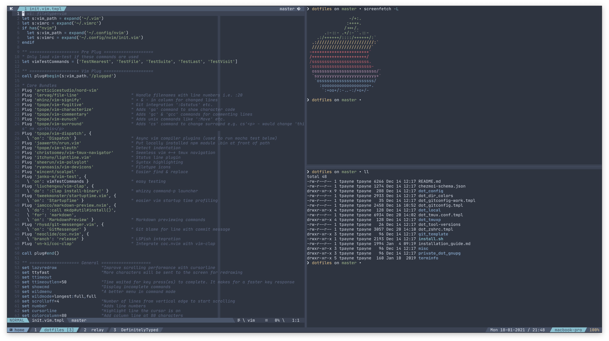

# Dotfiles



A place for all my dotfiles and each one in its place.

## Installation

```bash
curl -sfL https://git.io/JsiiF | sh
```

For the full setup guide, follow [this](./public/installation_guide.md).

## [Chezmoi](https://www.chezmoi.io/)

> Manage your dotfiles across multiple machines, securely

I use chezmoi to put all my dotfiles into place and make them work across different OS's.

JSON schema for `~/.config/chezmoi/chezmoi.json` is available [here](./public/chezmoi-schema.json).

## [Nix](https://nixos.org/)

> Nix is a powerful package manager for Linux and other Unix systems that makes package management reliable and reproducible. Share your development and build environments across different machines.

I use Nix (and [home-manager](https://github.com/rycee/home-manager)) to manage my required packages. Things like neovim, tmux, git, etc. all get installed using nix and are configured by [code](./dot_config/nixpkgs/home.nix.tmpl).

## Terminals

| Terminal                                                  | Tested OS                                                               | Managed config | Notes                                                                                                                                                            |
| --------------------------------------------------------- | ----------------------------------------------------------------------- | -------------- | ---------------------------------------------------------------------------------------------------------------------------------------------------------------- |
| [Kitty](https://sw.kovidgoyal.net/kitty/) - Preferred     | <ul><li>MacOS</li><li>Chrome OS</li></ul>                               | Yes            | <ul><li>GPU accelerated</li><li>Supports ligatures</li><li>Supports powerline fonts well</li></ul>                                                               |
| [Alacritty](https://github.com/alacritty/alacritty)       | <ul><li>MacOS</li><li>Chrome OS</li><li>Linux</li><li>Windows</li></ul> | Yes            | <ul><li>GPU accelerated</li><li>Very slim feature set (needs tmux)</li><li>Doesn't support ligatures</li><li>Doesn't support powerline fonts very well</li></ul> |
| [Windows Terminal](https://github.com/microsoft/terminal) | <ul><li>Windows</li></ul>                                               | No             | <ul><li>Works well on windows</li></ul>                                                                                                                          |

## Colour scheme

[Catppuccin](https://github.com/catppuccin) theme for neovim, tmux, kitty, alacritty, etc.

## [`asdf`](https://asdf-vm.com/#/)

`asdf` is a great tool for managing multiple versions of the same software, e.g. node, yarn, etc. These work via plugins and it removes the overhead of thinking which version you need and changing to it - it just works. See the [installation script](https://github.com/tapayne88/dotfiles/blob/35538ef7051b81fe103049c3ce665aee3db572a8/public/install.sh#L96-L99) for a list of used plugins.

## Fonts

To get ligature/italic font support there are a number of steps. You'll want to source a font like [JetBrains Mono](https://www.jetbrains.com/lp/mono/) and install it. If you want icons you'll probably want the [Nerd Fonts](https://www.nerdfonts.com/font-downloads) version.

### Updating the font files

For Linux systems which rely on the fonts in [`dot_local/share/fonts`](./dot_local/share/fonts) the following script can be run to download the latest font files from Nerd fonts.

```bash
./dot_local/share/fonts/update-fonts

# Clean up the old font files
rm ~/.local/share/fonts/JetBrainsMonoNerdFont*

# Apply the new font files
chezmoi apply -v

fc-cache -r
```

_N.B_ MacOS manages it's fonts through Homebrew.

## Windows Utilities

| Utility                                                 | Description                                                                          |
| ------------------------------------------------------- | ------------------------------------------------------------------------------------ |
| [scoop](https://scoop.sh/)                              | Windows version of [homebrew](https://brew.sh/)                                      |
| [xdg-open-wsl](https://github.com/cpbotha/xdg-open-wsl) | Make things like vim's `MarkdownPreview` work                                        |
| [sharpkeys](https://github.com/randyrants/sharpkeys)    | Remap individual keys - useful for HHKB on windows without messing with dip switches |
| [PowerToys](https://github.com/microsoft/PowerToys)     | Nice tools, good for keyboard chord remapping                                        |
