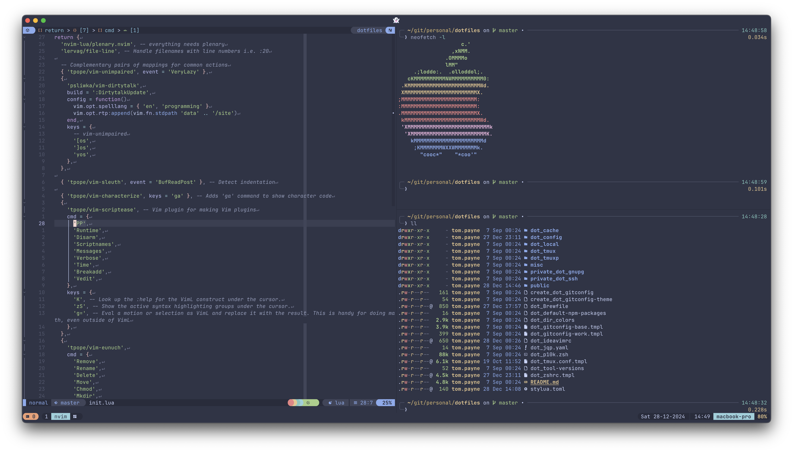

# Dotfiles



A place for all my dotfiles and each one in its place.

## Installation

```bash
curl -sfL https://git.io/JsiiF | sh
```

For the full setup guide, follow [this](./public/installation_guide.md).

## [Chezmoi](https://www.chezmoi.io/)

> Manage your dotfiles across multiple machines, securely

I use chezmoi to put all my dotfiles into place and make them work across different OS's.

JSON schema for `~/.config/chezmoi/chezmoi.json` is available [here](./public/chezmoi-schema.json).

## [Nix](https://nixos.org/)

> Nix is a powerful package manager for Linux and other Unix systems that makes package management reliable and reproducible. Share your development and build environments across different machines.

I use Nix (and [home-manager](https://github.com/rycee/home-manager)) to manage my required packages. Things like neovim, tmux, git, etc. all get installed using nix and are configured by [code](./dot_config/nixpkgs/home.nix.tmpl).

## Terminals

[Ghostty](https://ghostty.org/).

## Colour scheme

[Catppuccin](https://github.com/catppuccin) theme for neovim, tmux, kitty, alacritty, etc.

## [`asdf`](https://asdf-vm.com/#/)

`asdf` is a great tool for managing multiple versions of the same software, e.g. node, yarn, etc. These work via plugins and it removes the overhead of thinking which version you need and changing to it - it just works. See the [installation script](https://github.com/tapayne88/dotfiles/blob/35538ef7051b81fe103049c3ce665aee3db572a8/public/install.sh#L96-L99) for a list of used plugins.
